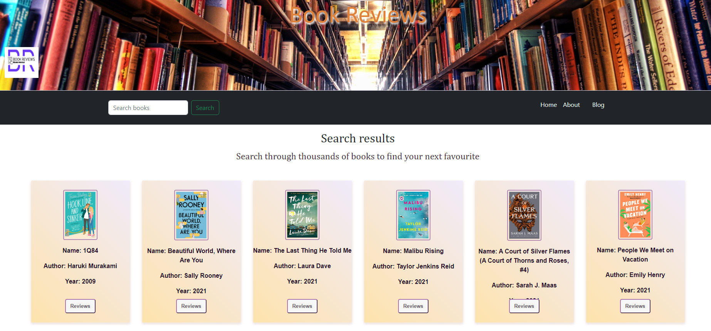

# Title
Books Review Site

# Books Review Site

## Description
Welcome to the Books Review Site! This website is a platform for book lovers to discover, rate, and review books of all genres. Users can create an account, add books to their reading list, and share their thoughts and opinions on books they have read.

## Features

Book search functionality
Book rating system
Book review system
Reading list management

## Technologies Used

HTML/CSS
JavaScript
React
Node.js
Bootstrap

## Installation
Clone the repository: git clone git@github.com:Ailsadm/review-site.git
Install dependencies: npm install
Start the server: npm start# Title
Books Review Site

## Description
Welcome to the Books Review Site! This website is a platform for book lovers to discover, rate, and review books of all genres. Users can create an account, add books to their reading list, and share their thoughts and opinions on books they have read.

## Features

Book search functionality
Book rating system
Book review system
Reading list management

## Technologies Used

HTML/CSS
JavaScript
React
Node.js
Bootstrap

## Installation
Clone the repository: git clone git@github.com:Ailsadm/review-site.git
Install dependencies: npm install
Start the server: npm start

## Contributing

Contributors are welcomed!
If you'd like to contribute to this project, please follow these steps:
Fork the repository
Create a branch: git checkout -b feature/new-feature
Make your changes and commit them: git commit -m 'Add new feature'
Push to the branch: git push origin feature/new-feature
Submit a pull request.

## Credit:
Ailsa McGowan
Florian Cretu 
Russel Richard
Mariana Asavoaiei

## License
This project is licensed under the MIT License - see the LICENSE file for details.

* Screenshot of page

 
 

## Deployed Application

* Link to deployed application:

* https://dulcet-taffy-cd0ae0.netlify.app/

## Contributors

Contributors are welcomed!
If you'd like to contribute to this project, please follow these steps:
Fork the repository
Create a branch: git checkout -b feature/new-feature
Make your changes and commit them: git commit -m 'Add new feature'
Push to the branch: git push origin feature/new-feature
Submit a pull request.

## Credit:
Ailsa McGowan
Florian Cretu 
Russel Richard
Mariana Asavoaiei

## License
This project is licensed under the MIT License - see the LICENSE file for details.

* Screenshot of page

 
 

## Deployed Application

* Link to deployed application:

* https://dulcet-taffy-cd0ae0.netlify.app/

* Screenshot of page

 

## Deployed Application

* Link to deployed application:

* https://dulcet-taffy-cd0ae0.netlify.app/

## Application Requirements

You and your group will use everything you’ve learned to create a real-world client-side single-page application that you’ll be able to showcase to potential employers. The user story and acceptance criteria will depend on the project that you create, but your project must fulfill the following requirements:

* Must use ReactJS.

* Must use Node.

* Must have both GET and POST routes for retrieving and adding new data.

* Must deploy this application using Netlify.

* Must utilize at least two libraries, packages, or technologies that we haven't discussed.

* Must have a polished front end/UI.

* Must meet good quality coding standards (indentation, scoping, naming).

* Have a quality README (with unique name, description, technologies used, screenshot, and link to deployed application).

## Authors

* Meri Asavoaiei

* Russel Richard

* Ailsa McGowan

* Florian Cretu

## Description
Books Reviews Website, that fetches book data from an API which shows on the card components dynamically. The Reviews button takes you to another component which takes the bookTitle from the first API and loads it into a API from NYTimes that fetches reviews for that particular book. On the reviews page there is also a form that allows the user to enter their own review of the book, this is saved to local storage and once the page is refreshed it loads it to the page to show the user review aswell. 

